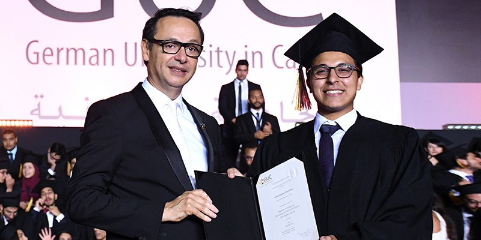
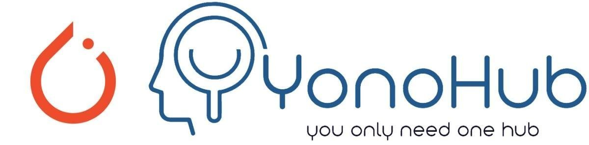
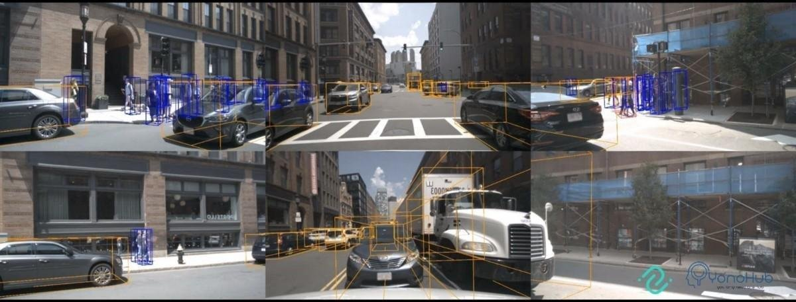

# Personal Information
- Full Name: Ahmed Magdy Ahmed Attia Hendawy
- Birth Date: 19.06.1996.

# Education

## German University in Cairo (Sep.2014-Jul.2019) 
- Bachelor of Science in Mechatronics Engineering
- **Grade**: Excellent with the Highest Honor
- **CGPA**: 0.83/0.7
- **Rank**: Second Rank among 271 Students

## Technical University in Munich (Mar.2018-Jul.2018)
- **Bachelor Thesis**: A Hybrid Approach for Constrained Deep Reinforcement Learning
- **GPA**: 0.7 (GUC GPA Criterion), 1.0 (TUM GPA Criterion)

# Employment History

## Avelabs

### YonoHub Developer Advocate 

#### Medium Articles

[Image Classification using Torchvision Pre-trained Models in a Single YonoArc Block
"](https://medium.com/@ahmedmagdyattia1996/image-classification-using-torchvision-pre-trained-models-in-a-single-yonoarc-block)  
 

---
### YonoHub Developer Advocate Intern (Jun.2019-Sep.2019)
#### Medium Articles

["nuScenes — Using Yonohub to develop, evaluate and benchmark over the cloud"](https://medium.com/@ahmedmagdyattia1996/nuscenes-using-yonohub-to-develop-evaluate-and-benchmark-over-the-cloud)
 
  
